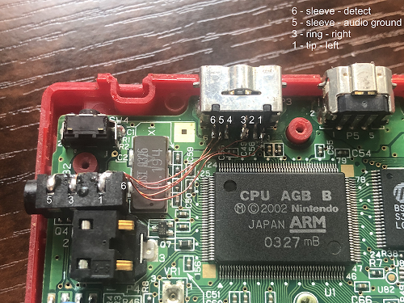

# gba-sp-headphone-jack
 A list of headphone jack mods for the Game Boy Advance SP.
 
 There's a few options to choose. None are perfectly ideal IMO - there isn't a lot of space to fit the headphone jack. Consider the pros and cons of each before committing - remember to consider ergonomics and where you hands will usually rest.

## Under power LEDs
Might affect ergonomics! I personally have [no issue](under-power-LED-ergonomics.jpg).

Preview | Links and info
------------ | -------------
 | [hackaday writeup](https://hackaday.io/project/173427-gba-sp-headphone-jack-mod)
| [imgur post](https://imgur.com/a/da826qH), [Github backup](backups/imgur-da826qH/)
| [discord post](https://discordapp.com/channels/246604458744610816/332487777986019337/734842804538179667)

## Inside top screen
Requires IPS screen mod to free up enough space.

Preview | Links and info
------------ | -------------
 | [makho Youtube](https://www.youtube.com/watch?v=L5i0NNrpfFw)

## Bottom-left screw post
Removes a screw post, so case isn't as tightly closed. Might affect ergonomics!

Preview | Links and info
------------ | -------------
 | [imgur post](https://imgur.com/a/mqhpRvp), [Github backup](backups/imgur-mqhpRvp/)
 | [The Retro Future Youtube](https://www.youtube.com/watch?v=MOywVfRrYTg)

## Between L and R buttons
Cuts into the battery compartment - requires a smaller battery.

Preview | Links and info
------------ | -------------
 | [imgur album aFbhm](https://imgur.com/a/aFbhm), [Github backup](backups/imgur-aFbhm/)

## In the hinge
Might reduce hinge strength/lifespan. Might affect ergonomics!

Preview | Links and info
------------ | -------------
 | [discord post](https://discordapp.com/channels/246604458744610816/332487777986019337/733445195001102468), [Github backup](backups/discord-sammy.sam/)

## USB-C dongle headphone jack
I personally don't want to need a dongle, but it's awesome to know this is an option!

Preview | Links and info
------------ | -------------
 | [666Gothicgirl Youtube](https://www.youtube.com/watch?v=5_2sGFCsaPw), [reddit post](https://www.reddit.com/r/Gameboy/comments/e62yc5/complete_my_cover_for_the_usb_c_port_that_i_build/f9qq91v/), [imgur album ruIvKuk](https://imgur.com/a/ruIvKuk), [Github backup](backups/imgur-ruIvKuk/)

## Bluetooth audio
Hey, that's not a headphone jack at all!

Preview | Links and info
------------ | -------------
 | [reddit post](https://www.reddit.com/r/Gameboy/comments/eg937m/gameboy_advance_sp_bluetooth_audio_mod/), [additional reddit post](https://www.reddit.com/r/Gameboy/comments/gc5k7x/gba_with_bluetooth_audio/), [Github backup](backups/gameboy-subreddit-eg937m/)

# Other GBA SP Mods
* [Mods - Game Boy Subreddit Wiki](https://www.reddit.com/r/GameBoy/wiki/mods)
* [GBA SP USB-C Mod](https://github.com/rorosaurus/gba-sp-usb-c)