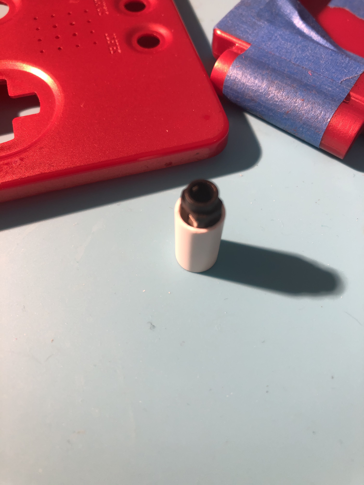
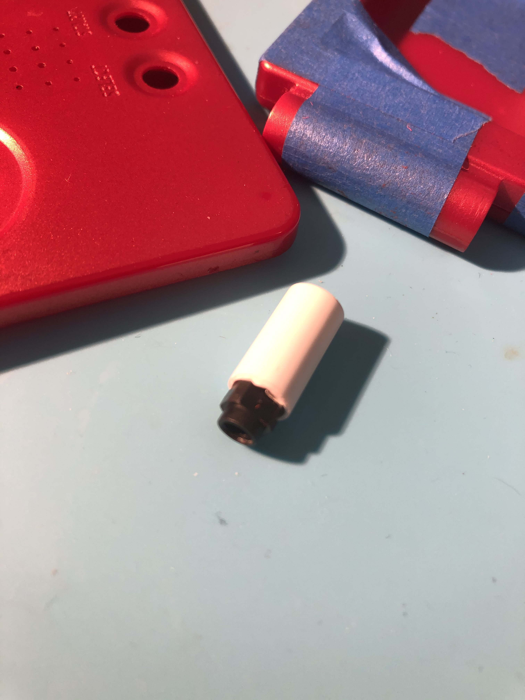
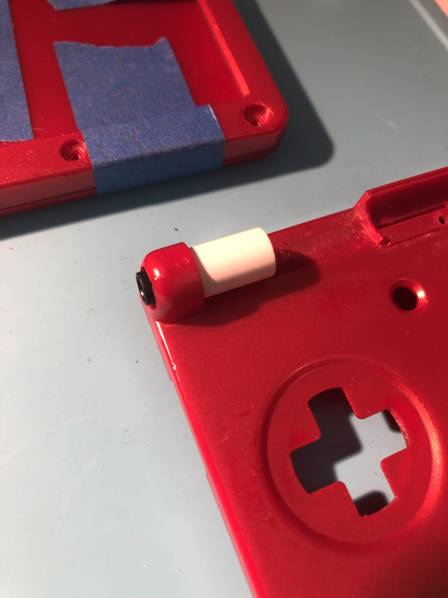
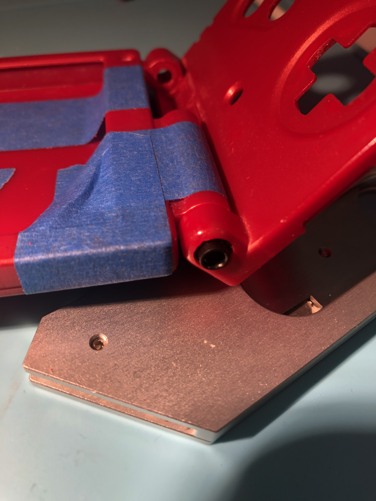
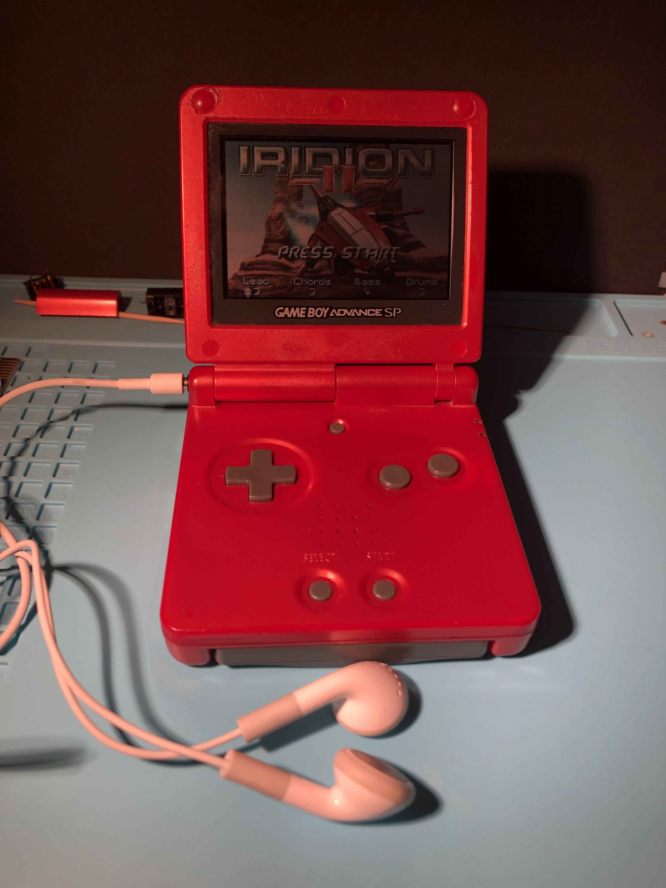
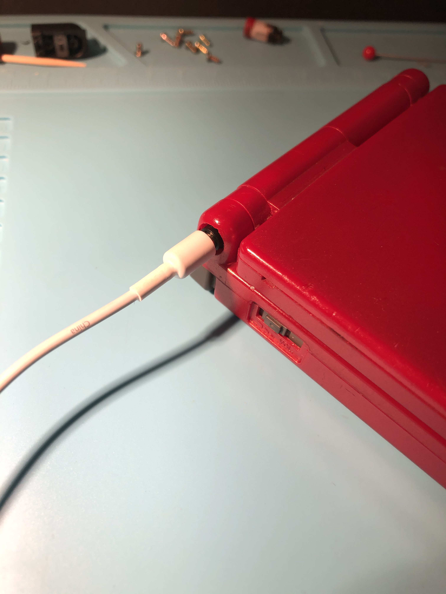
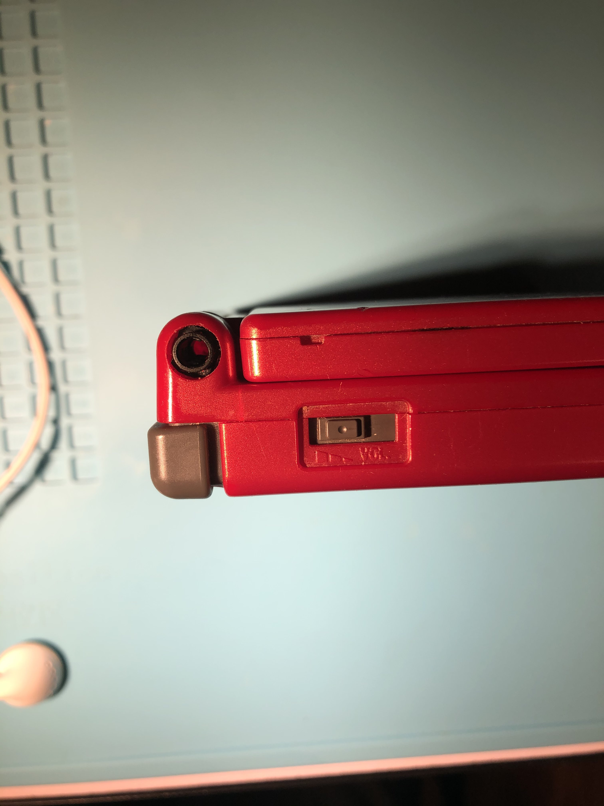
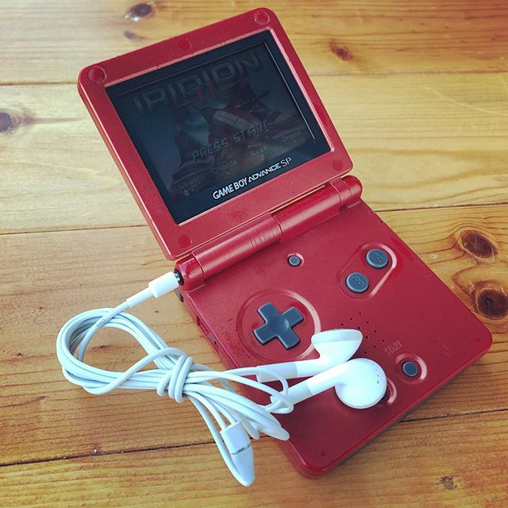

# sammy.sam Game Boy Discord #modding backup
Backed up here for reference in case discord images expire. Original link: https://discordapp.com/channels/246604458744610816/332487777986019337/733445195001102468

# I found a dumb place to put a headphone jack on the SP
July 16th 2020

If anyone has done that before or seen it done, let me know, I’m still not 100% about the final install

Like I guess epoxy the hinge barrel to the main body frame and let the top half hinge around that

I’m concerned I might not have the play necessary to get the top half back onto it though

Actually, nvm. I can just assemble the frame around it once it’s epoxied to the frame if it’s a problem

Ok, got the hinge jack working

It feels secure enough with the epoxy holding it in place, and it does still click into place since the right OEM hinge is there

The hinge is tight right now, but that’s because I milled out the hinge openings by hand with a rotary tool

Feels fine to me

The styrene tube I used was 7.9mm, so I considered using a 8mm drill bit, it would probably feel a little looser if I had done that

The jack placement is ok but not great, there are better placement options. So this is just a for fun mod

https://www.instagram.com/p/CCzr_ZOlZCR/

I modded a GBA SP with a headphone jack. Which isn’t new, but I hadn’t seen anyone attempt to put it in the hinge before. The right hinge is still OEM, the left hinge becomes the jack wrapped in a styrene tube. Then the wires are just routed through the rest of the hinge assembly and down to the PCB with the ribbon cable. You lose the locking feature on the left hinge, but the screen still locks into place when open and closed with the remaining right OEM. I get a lot of questions about how the hinge feels, and it’s pretty good, though you can feel the difference obviously since only one of the hinges now clicks.

I also added a USB C charge port mod, which isn’t new, but I used a really cool mounting PCB design by reddit user minhbang and his brother which allows the port to sit centered in the OEM charge port housing.

I’m not really pioneering any new ground here, but the jack placement is a fun novelty. I’ll probably do a v2 in a transparent shell to