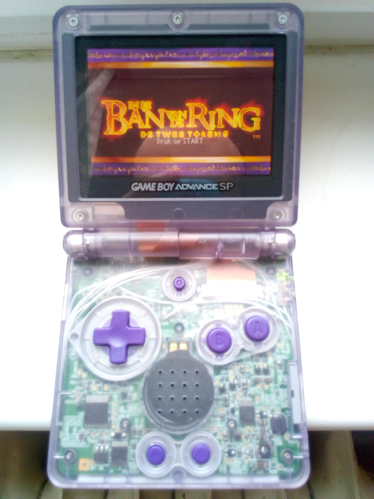
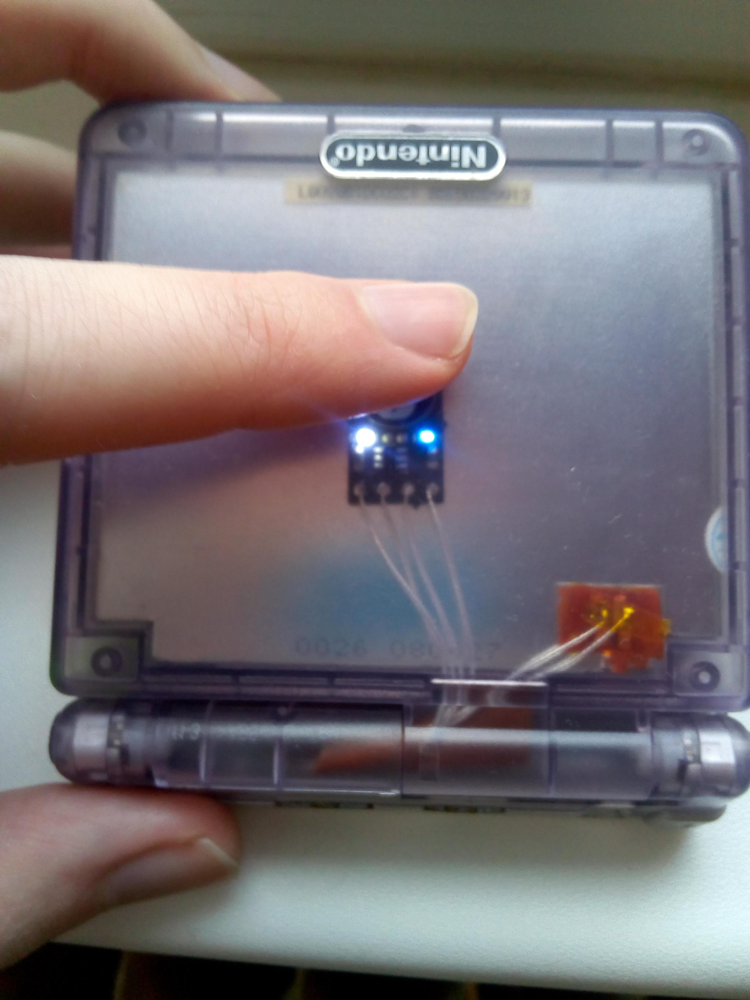
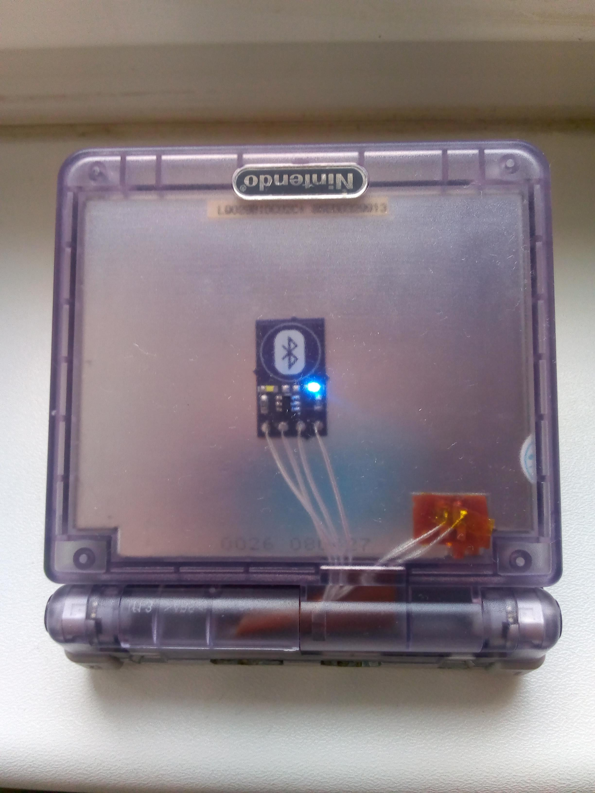
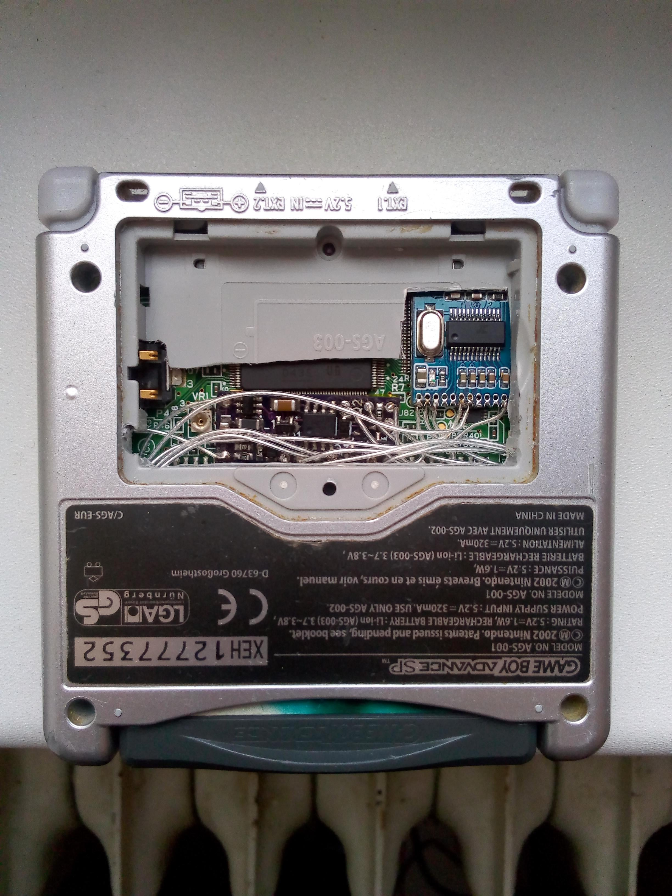
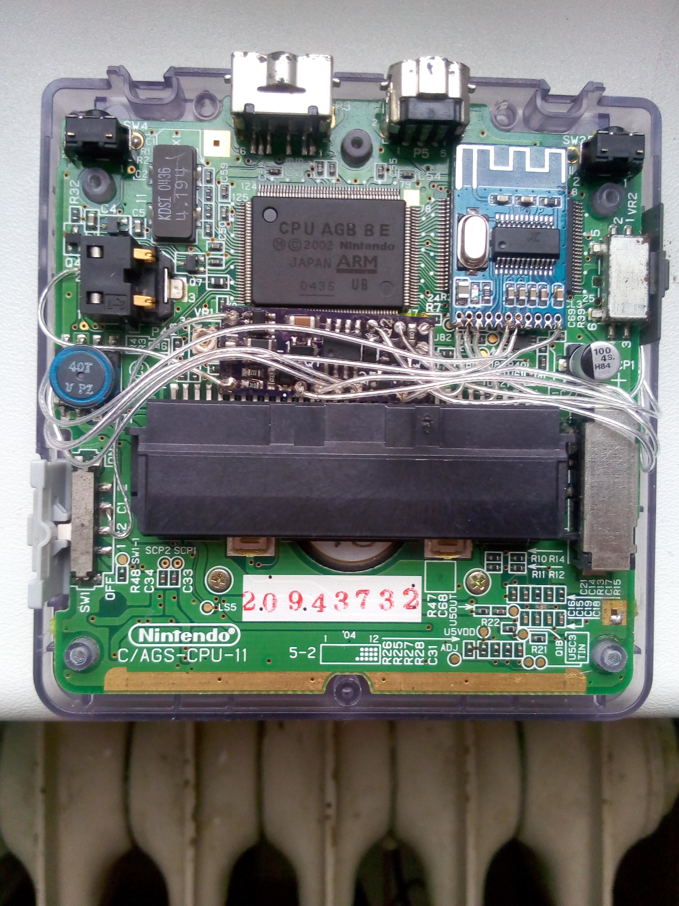
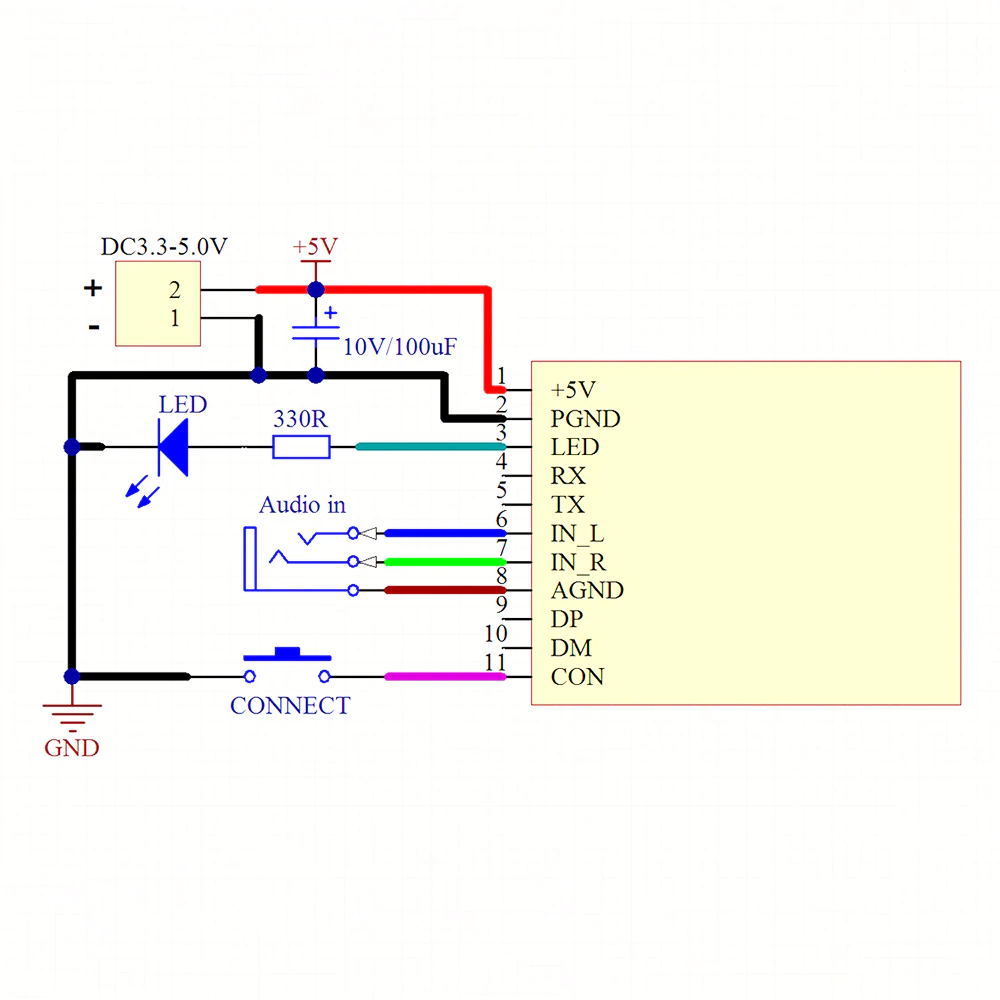

# gameboy-subreddit-eg937m backup
Backed up here for reference in case reddit images expire. Original link: https://www.reddit.com/r/Gameboy/comments/eg937m/gameboy_advance_sp_bluetooth_audio_mod/

# Gameboy Advance SP Bluetooth audio mod
submitted Dec 27 2019

Behold, maybe the only prototype as far I know !

Made from AGS-001. Aftermarket LCD. Custom PCBs to control the brightness with original button and switching on/off the Bluetooth module with touch sensing and pairing reset. Though battery compartment bottom needed to be partially sacrificed. The audio gets somehow noisy, so new PCB design is on its way.

BT module: https://www.aliexpress.com/item/33058710334.html

Wiring diagram:
