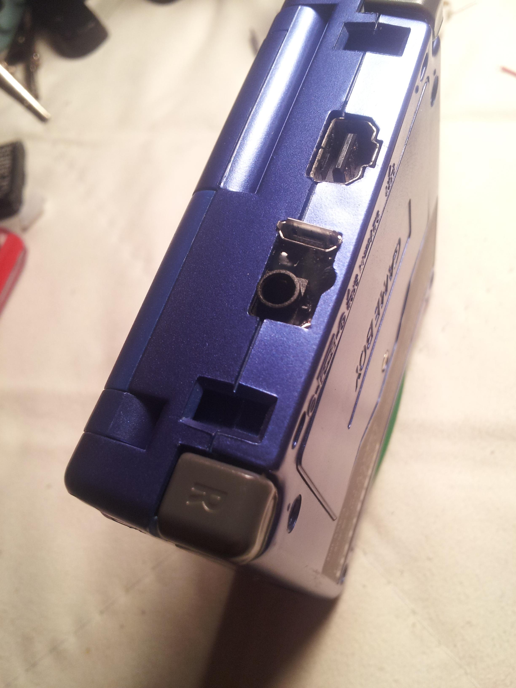
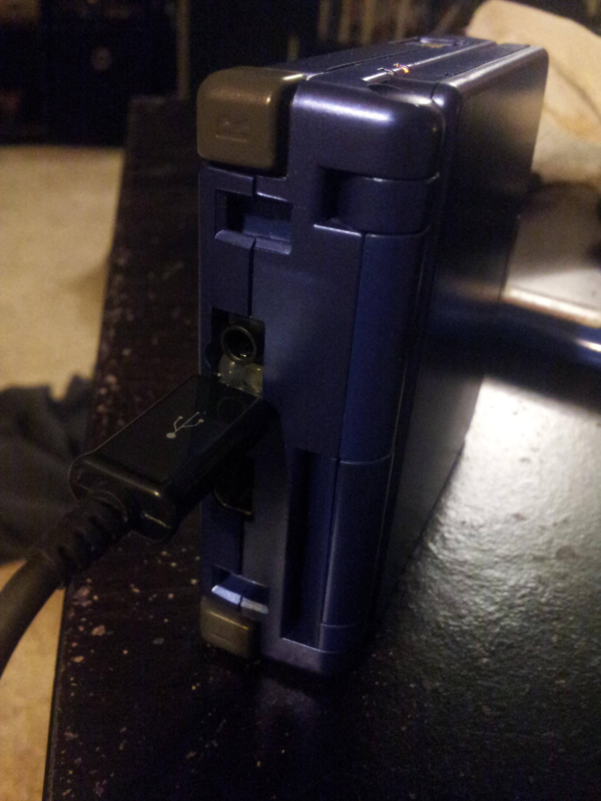
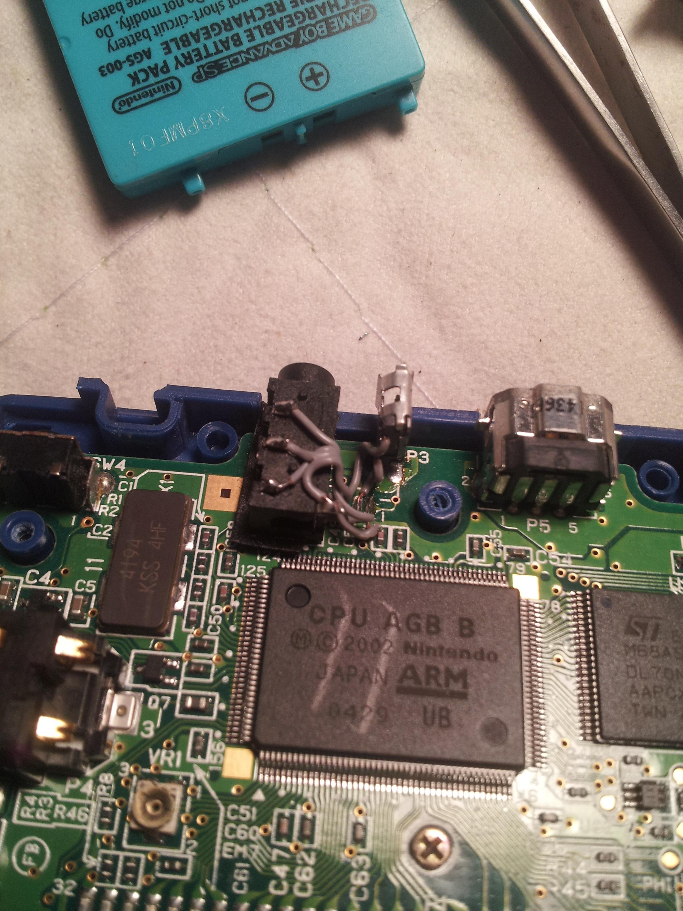
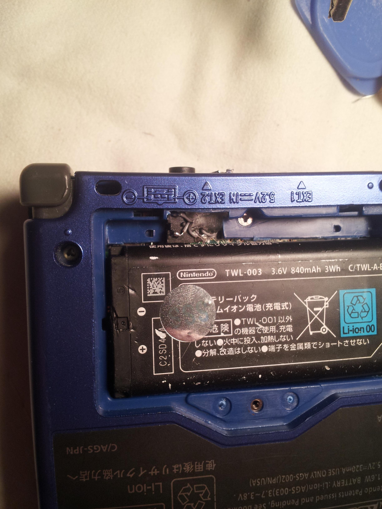
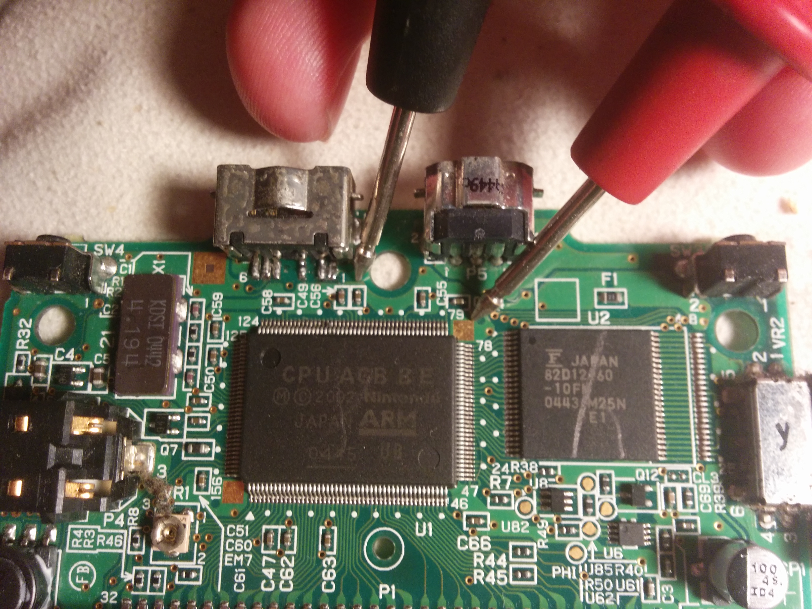
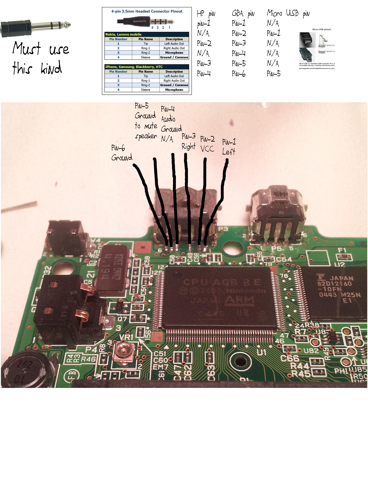

# imgur-aFbhm backup
https://imgur.com/a/aFbhm

Micro USB charge port and 3.5mm headphone port to replace the proprietary stock port. This headphone port is wired correctly so that the speaker shuts off when headphones are plugged in.

Both ports wired up to the pins.
The trick is that this is a 4-pin headphone port, usually the extra pin is meant for a microphone line. By using a regular three terminal pair of headphones, the 4th mic pin is grounded out through the headphone pin.

How it all looks in place.
still trimming the battery compartment to fit the DSI battery properly. the trick to fitting a headphone port here is to use the DSi battery to make room. of course this is a benefit itself as it's a larger than stock battery.

WIRING EDIT!

 I put this picture before the wiring diagram so people don't miss in. 

when I wired it up like I have below, it actually didn't work quite right. If I recall, the headphones would not work when plugged in. to make it work, I used a different ground point. here you can see the small caps (C49 or C56) that I soldered to for ground. If those are too small for you to be comfortable soldering to, the square next to the CPU I'm pointing to is also ground.

Basically Ignore pins 4 and 6 below (ground and audio ground) and use one of these points instead.

The pinout - you might have to zoom
I found that some of the port pinouts online are not correct. here you can see the correct pinout, as well as what pins they go to on which port.

NOTE!! the 3rd mic pin on the 3.5mm port grounds out through the negative terminal of a 3 pin headphone plug. this is how the speaker shut off works. to make it work, you MUST use a 3 pin headphone jack like seen in the top left.